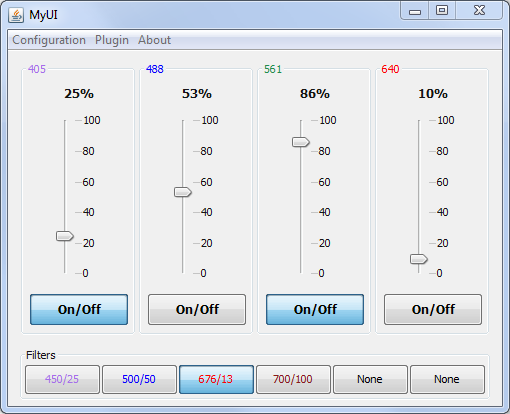
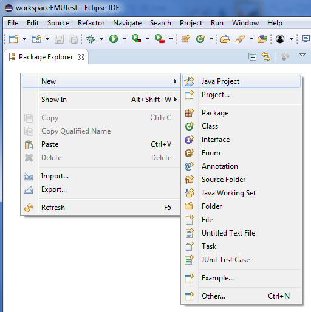
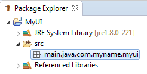
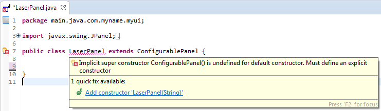
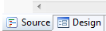
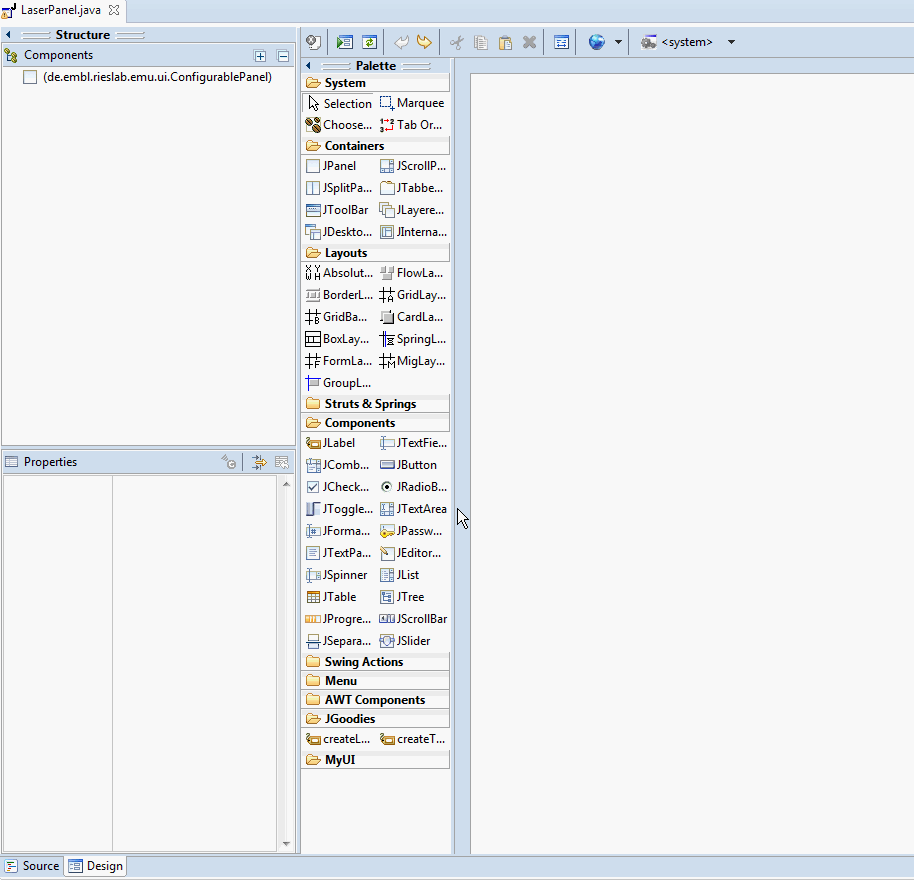
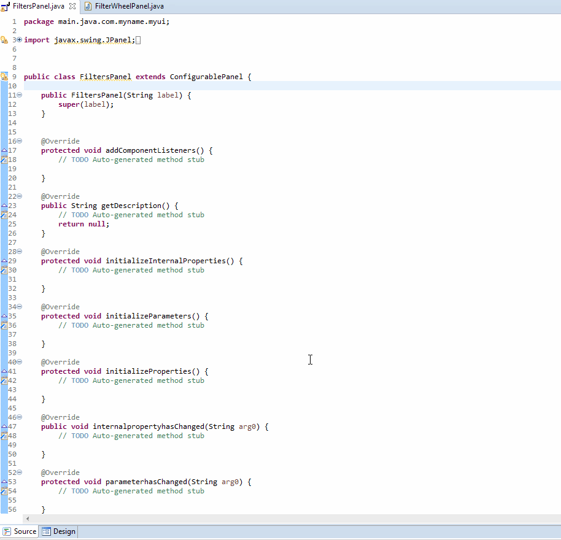
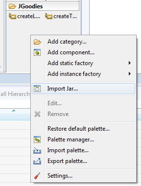
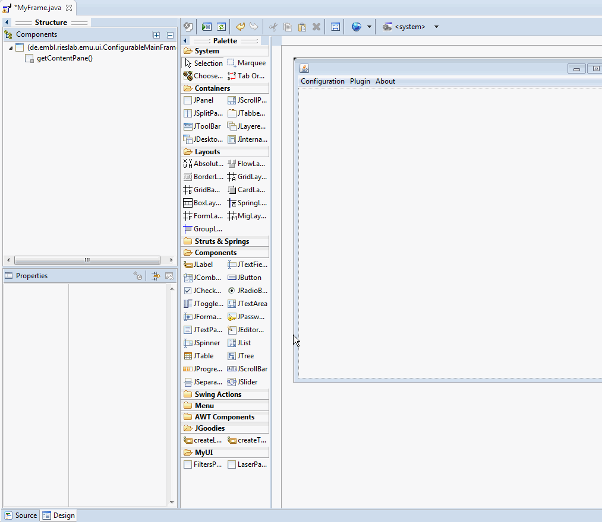
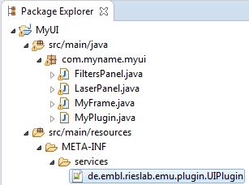

# EMU tutorial: building a UI

This tutorial is a simple example walk-through of how to build a plugin for EMU, in order to obtain a re-configurable user interface within Micro-Manager. 

Here is a preview of the UI:

<p align="center">

</p>

#### Prerequisite

- [Eclipse](https://www.eclipse.org/) with the [WindowBuilder plugin]() running java 8.
- Micro-Manager 2gamma installed.
- EMU installed (refer to the [installing section](https://github.com/jdeschamps/EMU)).


#### During the tutorial

- You can consult the [guide]() for more in-depth details.
- The [source code]() can be found in the "source" folder.


## A - Making sure that eclipse runs java 8

**1)** In Eclipse, go to "**Window -\> Preferences -\> Java -\> Installed JREs**" and make sure that java 1.8 or 8 is known and is the default. 


## B - Setting up the eclipse projects

 **2)** Create your own project: in the "**Package Explorer**" window, right-click and create a new "**Java Project**".

<p align="center">

</p>


**3)** In the pop-up window, set the name of your project (e.g. "MyUI"). Make sure that Java 8 (or 1.8) is selected in the **JRE** section. Click **next**.


**4)** In the "**Librairies**" tab, click on "**Add External JARs**" and navigate to your Micro-Manager folder and then to the "**mmplugins**" subfolder. Select the EMU jar (**EMU-1.0-SNAPSHOT.jar**). Click again on "**Add External JARs**", this time navigate to the "**plugins\Micro-Manager**" folder in Micro-Manager and select both **MMCoreJ.jar** and **MMJ_.jar**. Click **finish**. 

> Note: If the jar is not present in the folder, then EMU was not properly installed (refer to the [EMU repository]( https://github.com/jdeschamps/EMU)).


**5)** Right click on the project and create a new "**package**". By convention, the folder tree should be "src/main/java/" and followed by reverse domain name. e.g. com/myname/myui. Therefore, enter "main.java.com.myname.myui". You should then see:

<p align="center">

</p>

Right-click on the project and select "**Properties**". In **Java Build Path** and the **Source tab**, select **MyUI/src** and remove it from the source. Then click on "**Add Folder**" and tick the **java** folder and **OK**.


## C - Setting up the laser panel: ConfigurablePanel

In this section, we will encounter the first EMU class: [ConfigurablePanel](). ConfigurablePanels are the building blocks of an EMU UI. The important steps before building a ConfigurablePanel are:

- What will the panel look like? (what [JComponents](), in which order)
- What configurable [parameters]() do we want? (title, title color, names...etc...)
- What [properties]() should be modified by the panel? (e.g. a laser on/off)

In our case, here we want:

- JComponents: a JToggleButton for on/off and a JSlider to set the power percentage.

- UIParameters: name and color of the laser.

- UIProperties: laser on/off and laser power percentage.

  

**6)** Right click on your package (here "com.myname.myui") and select "**new -\> other**". In the pop-up, select "**WindowBuilder/Swing Designer/JPanel**". Click **next**.

> Note: If WindowBuilder or Swing Designer do not appear, then refer to the prerequisite section and follow the link to install the WindowBuilder. 


**7)** Name the JPanel, e.g. "*LaserPanel*". In the "**superclass**" section, search for "**ConfigurablePanel**". Click **finish**. The LaserPanel should now appear in the package explorer.

> Note:  If ConfigurablePanel does not appear, then EMU was not properly imported (refer to **4**). 


**8)** Delete the LaserPanel() constructor, you "LaserPanel.java" should then look like the following:

```java
package com.myname.myui;

import javax.swing.JPanel;
import de.embl.rieslab.emu.ui.ConfigurablePanel;

public class LaserPanel extends ConfigurablePanel {

}
```


**9)** Place your cursor on the "LaserPanel" class name and select "**Add constructor**":

<p align="center">

</p>

> Note: If Eclipse does not suggest anything when the mouse is placed on the error, then look at the preferences in "**Window/Preferences**" in the section "**Java/Editor/ContentAssist**".


Eclipse should generate a new Constructor with a String parameter. This parameter will ultimately be the name of the ConfigurablePanel.


**10)** The class name should still show an error. Place the cursor on the class name again, and select "**Add unimplemented methods**".


**11)** In the bottom of the Java editor, a tab allows you to visit the WindowBuilder designer. Click on "design".

<p align="center">


**12)** We are now going to use the drag and drop tools to build the laser panel. Here is an animated gif of the different steps:

<p align="center">



1. In the **Layouts** section of the Palette, select "AbsoluteLayout" and click on the panel.

2. Click on the panel, in the **Properties**, select **border** and, in the pop-up window, choose "TitledBorder". Enter the title and choose the left justification.

3. Place a **JLabel** (from the palette). Enter a placeholder text (such as "70%"). In the **Properties**, choose a CENTER **horizontalAlignment**. Click on the **font** property, increase the font to 12 and make it bold.

4. Place a **JSlider** on the panel. In the **Properties**, choose a VERTICAL **orientation**. Then check **paintLabels** and **paintTicks**. Finally sets the **majorTickSpacing** to 20 (note that the minimum is 0 and the maximum 100).

5. Place a **JToggleButton** at the bottom of the panel and enter its text (e.g.: "On/Off"). Resize the font as previously.

6. Resize all three components and the panel to make it look aesthetically pleasant.

   

**13)** For each component (JLabel, JSlider and JToggleButton), right click on it in the **Structure** tab and select "**Expose component**". Select **protected** and click **OK**.


**14)** We will now implement the empty methods created earlier. Go back to the java editor by clicking on the **Source** tab.


**15)** The method **getDescription()** returns a String describing the what the panel is intended for. Replace the "**null**" in the return statement:

```java
@Override
public String getDescription() {
	return "Panel controlling the power percentage and operation of a single laser.";
}
```


**16)** Let's create the two properties. First we create two convenience variables:

```java
public class LaserPanel extends ConfigurablePanel {
	private JLabel label_1;
	private JSlider slider;
	private JToggleButton tglbtnOnoff;
	
	//////// Properties
	public final static String LASER_PERCENTAGE = "power percentage";
	public final static String LASER_OPERATION = "enable";
    
	[...]
```

Then in the initializeProperties() method, we declare the two properties:

```java
@Override
protected void initializeProperties() {
	String text1 = "Property changing the power percentage of the laser.";
	String text2 = "Property turning the laser on/off.";
	String propertyPercentage = getPanelLabel() + " " + LASER_PERCENTAGE;
	String propertyOperation = getPanelLabel() + " " + LASER_OPERATION;
		
	addUIProperty(new UIProperty(this, propertyName1, text1, new NoFlag()));
	addUIProperty(new TwoStateUIProperty(this, propertyName2, text2, new NoFlag()));
}
```

Use again Eclipse suggestions to import the UIProperty, TwoStateUIProperty and NoFlag classes.


**17)** Now that the UIProperties have been declared, let's implement the effect of the user interactions with the components on the properties. We are going to use static methods made available by EMU. In the addComponentListeners() method:

```java
@Override
protected void addComponentListeners() {
	String propertyName1 = getPanelLabel() + " " + LASER_PERCENTAGE;
	String propertyName2 = getPanelLabel() + " " + LASER_OPERATION;
    
	SwingUIListeners.addActionListenerOnIntegerValue(this, propertyName1, slider, 
                                                     label_1, "", "%");
    
	try {
		SwingUIListeners.addActionListenerToTwoState(this, propertyName2, tglbtnOnoff);
	} catch (IncorrectUIPropertyTypeException e) {
		e.printStackTrace();
	}
}
```
As done previously, use the Eclipse suggestions to import the missing class. SwingUIListeners offers a bunch of methods to simplify writing the action listeners in EMU. The first method takes the value of JSlider and sets the value of the UIProperty. In addition, it also change the text of the JLabel (adding an empty String to the beginning of the text and "%" to the end, as specified in the method's call). The second method expects a TwoStateUIProperty (hence the try/catch clause). When the JToggleButton is selected, the TwoStateUIProperty will be set to its on state and inversely when the JToggleButton is unselected.


**18)**  The last step that concerns the properties is to define what happens when a UIProperty changes. Let's move to the propertyhasChanged(...) method:

```java
@Override
protected void propertyhasChanged(String propertyName, String newvalue) {
	String propertyName1 = getPanelLabel() + " " + LASER_PERCENTAGE;
	String propertyName2 = getPanelLabel() + " " + LASER_OPERATION;
		
	if (propertyName1.equals(propertyName)) {
		if (EmuUtils.isNumeric(newvalue)) {
			int val = (int) Double.parseDouble(newvalue);

			if (val >= 0 && val <= 100) {
				slider.setValue(val);
				label_1.setText(String.valueOf(val) + "%");
			}
		}
	} else if (propertyName2.equals(propertyName)) {
		try {
			String onValue = ((TwoStateUIProperty) getUIProperty(propertyName2))
                .getOnStateValue();
			tglbtnOnoff.setSelected(newvalue.equals(onValue));
		} catch (UnknownUIPropertyException e) {
			e.printStackTrace();
		}		
    }
}
```

Here, we first check which property has changed. If the percentage property has changed, we make sure that the String a number, then we round it up to an Integer. If the value is a percentage, we update the JSlider and the JLabel. If the propery is the laser on/off, we retrieve the "ON state" of the TwoStateUIProperty (which, depending on the laser, can be "enable" or "1" or "on"). Then depending on whether the new value corresponds to the "ON state" or not, we update the JToggleButton.

Now that the UIProperties have been tackled, let's turn our attention to the UIParameters.


**19)** We want two UIParameters: the panel title (TitledBorder's title) and its color. As for the properties, let's define some convenience variables:

```java
public class LaserPanel extends ConfigurablePanel {
	private JLabel label_1;
	private JSlider slider;
	private JToggleButton tglbtnOnoff;
	
	//////// Parameters
	public final static String PARAM_TITLE = "Name";
	public final static String PARAM_COLOR = "Color";	
    
    [...]
```

Then in initializeParameters(), we declare the UIParameters:

```java
@Override
protected void initializeParameters() {
	addUIParameter(new StringUIParameter(this, PARAM_TITLE, "Panel title.",
                                         getPanelLabel()));
	addUIParameter(new ColorUIParameter(this, PARAM_COLOR, "Laser color.", Color.black));
}
```

Import the missing classes using Eclipse suggestions. We declared two parameters: a String for the name and a Color. Both UIParameters require a default value: we use here the ConfigurablePanel label (using the getPanelLabel() method) and the black color (Color.black).


**20)** Let's now define what happens when the UIParameters change. This happens when starting EMU or modifying the configuration. 

```java
@Override
protected void parameterhasChanged(String parameterName) {
	if (PARAM_TITLE.equals(parameterName)) {
		try {
			((TitledBorder) this.getBorder())
                	.setTitle(getStringUIParameterValue(PARAM_TITLE));
			this.repaint();
		} catch (IncorrectUIParameterTypeException | UnknownUIParameterException e) {
			e.printStackTrace();			
        }
    } else if (PARAM_COLOR.equals(parameterName)) {
		try {
			((TitledBorder) this.getBorder())
               	.setTitleColor(getColorUIParameterValue(PARAM_COLOR));
			this.repaint();
		} catch (IncorrectUIParameterTypeException | UnknownUIParameterException e) {
			e.printStackTrace();
		}
	}
}
```

In both cases, we retrieve the TitledBorder of the panel. We then change either its title or its color. The try/catch clauses are here in case the parameterName is wrong or of the wrong type (String or Color).

We have now a fully functional EMU ConfigurablePanel with two UIProperties and two UIParameters.


## D - Setting up the filters panel

This time we want:

- JComponents: a ButtonGroup with six JToggleButtons (button group means only one button can be selected at a time, just like in a filter wheel).

- UIParameters: name and color of the six filters.

- UIProperties: filter wheel position (with value 1 to 6).

**21)** Repeat steps **6** to **10**, albeit with a "FiltersPanel" class.

**22)** Design the ConfigurablePanel:

<p align="center">



1. In the **Layouts** section of the Palette, select "**GridLayout**" and click on the panel.
2. Click on the panel, in the **Properties**, select **border** and, in the pop-up window, choose "**TitledBorder**". Enter the title and choose the left justification.
3. Place a **JToggleButton** (from the palette) on the panel. Enter a placeholder text (such as "Filter 1"). 
4. Repeat by adding **JToggleButtons** on the right of the panel (up to 6).
5. Select all **JToggleButtons** in the Components section, and **show advanced properties** in the Properties section (upper right button in the same section). Go to **margin**, set the left and right margin to 2 pixels (so that longer filter names are not cut).
6. With all the **JToggleButtons** still selected, right-click on them and set a **new standard ButtonGroup**.
7. Finally, right-click again and **expose the components** as protected elements.
8. **Resize** the panel to make it look aesthetically pleasant.


**23)** Let's now create the UIProperties and UIParameters. First, let's declare some convenience static strings:

```java
public class FiltersPanel extends ConfigurablePanel {
    
	// generated by Eclipse WindowBuilder
	private final ButtonGroup buttonGroup = new ButtonGroup();
	private JToggleButton tglbtnFilter;
	private JToggleButton tglbtnFilter_2;
	private JToggleButton tglbtnFilter_1;
	private JToggleButton tglbtnFilter_5;
	private JToggleButton tglbtnFilter_4;
	private JToggleButton tglbtnFilter_3;

	//////// Properties
	public final static String FW_POSITION = "Filterwheel position";
	
	//////// Parameters
	public final static String PARAM_NAMES = "Filter names";
	public final static String PARAM_COLORS = "Filter colors";
	
	//////// Initial parameter
	public final static int NUM_POS = 6;
    
    [...]
```

We declare a MultiStateUIProperty with 6 positions (one per filter):

```java
@Override
protected void initializeProperties() {
	String description = "Filter wheel position property.";
	addUIProperty(new MultiStateUIProperty(this, FW_POSITION, description, new NoFlag(), 
                                           NUM_POS));				
}
```

Such UIProperty can only take one of those 6 positions. We also define what happens when the MultiStateUIProperty changes:

```java
@Override
protected void propertyhasChanged(String propertyName, String newvalue) {
	if(FW_POSITION.equals(propertyName)){
		int pos;
		try {
			pos = ((MultiStateUIProperty)getUIProperty(FW_POSITION))
                .getStatePositionNumber(newvalue);
			
			switch (pos) {
			case 0:
				tglbtnFilter.setSelected(true);
			case 1:
				tglbtnFilter_1.setSelected(true);
			case 2:
				tglbtnFilter_2.setSelected(true);
			case 3:
				tglbtnFilter_3.setSelected(true);
			case 4:
				tglbtnFilter_4.setSelected(true);
			case 5:
				tglbtnFilter_5.setSelected(true);
			}
		} catch (UnknownUIPropertyException e) {
			e.printStackTrace();
		}
	}
}
```

We define two UIParameters (names and colors) that we expect to be comma separated names and colors of the filters:

```java
@Override
protected void initializeParameters() {
	String names = "None";
	String colors = "grey";
	for (int i = 0; i < NUM_POS - 1; i++) {
		names += "," + "None";
		colors += "," + "grey";
	}

	String helpNames = "Comma separated filter names, e.g.:" 
        +"\"name1,name2,name3,name4,None,None\".";
	String helpColors = "Comma separated filter colors, e.g: "
        +"\"blue,dark red, dark green,orange,grey,grey\".";
				
	addUIParameter(new StringUIParameter(this, PARAM_NAMES, helpNames, names));
	addUIParameter(new StringUIParameter(this, PARAM_COLORS, helpColors, colors));
}
```

And what happens when they change:

```java
@Override
protected void parameterhasChanged(String parameter) {
	if(PARAM_NAMES.equals(parameter)){
		try {
			String value = getStringUIParameterValue(PARAM_NAMES);
			
			String[] astr = value.split(",");
			int maxind = NUM_POS > astr.length ? astr.length : NUM_POS;
				
			JToggleButton[] buttons = {tglbtnFilter,tglbtnFilter_1,tglbtnFilter_2,
        				tglbtnFilter_3,tglbtnFilter_4,tglbtnFilter_5};
			for(int i=0;i<maxind;i++) {
				buttons[i].setText(astr[i]);
			}
				
		} catch (IncorrectUIParameterTypeException | UnknownUIParameterException e) {
			e.printStackTrace();
		}
	} else if(PARAM_COLORS.equals(parameter)){
		try {
			String value = getStringUIParameterValue(PARAM_COLORS);
            
        	String[] astr = value.split(",");
			int maxind = NUM_POS > astr.length ? astr.length : NUM_POS;
				
			JToggleButton[] buttons = {tglbtnFilter,tglbtnFilter_1,tglbtnFilter_2,
                                       tglbtnFilter_3,tglbtnFilter_4,tglbtnFilter_5};
			for(int i=0;i<maxind;i++) {
				buttons[i].setForeground(ColorRepository.getColor(astr[i]));
			}
		} catch (IncorrectUIParameterTypeException | UnknownUIParameterException e) {
			e.printStackTrace();
		}
	}
}
```

We also need to set the effect of the user interaction with the button group. Here again, EMU provides a static method to do exactly what we want:

```java
@Override
protected void addComponentListeners() {
	SwingUIListeners.addActionListenerOnSelectedIndex(this, FW_POSITION, buttonGroup);
}
```

Finally, we need to give a description of the panel:

```java
@Override
public String getDescription() {
	return "A panel controlling a FilterWheel with 6 positions.";
}
```


## E - Exporting the compiled ConfigurablePanels

**24)** In order to assemble the panels, we need to compile them and export them as a **.jar**. Right-click on the project and select **Export**. Make sure "**JAR file**" is selected and click on **Next**. Choose the path (e.g. in the project folder) and click on **Finish**. The jar file should appear in the Eclipse package explorer.


## F - Assembling the panels in a ConfigurableMainFrame

**25)** Right click on your package (here "com.myname.myui") and select "**new -\> other**". In the pop-up, select "**WindowBuilder/Swing Designer/JFrame**". Click **next** and, in the **superclass** field , select "**ConfigurableMainFrame**". Click on **finish**.


**26)** Use the eclipse suggestion to add all unimplemented methods. Then, add a call to the superconstructor on the generated constructor and comment out the setDefaultCloseOperation line. Then, create another constructor:

```java
public MyFrame() {
	super("",null,null); // calls superconstructor
	setBounds(100, 100, 450, 300);
	// setDefaultCloseOperation(JFrame.EXIT_ON_CLOSE);
}

public MyFrame(String arg0, SystemController arg1, TreeMap<String, String> arg2) {
	super(arg0, arg1, arg2);
}
```

Fix the imports of SystemController and TreeMap.


**27)** Go to the **Design** tab. In the bottom of the **Palette**, right-click and select **Import JAR**. In the pop-up window, select the **Jar Archive** to be **MyUI.jar**. Answer yes to "Show all classes?". Finally, check both FiltersPanel and LaserPanel and click **OK**. They should appear at the bottom of the **Palette**.

<p align="center">


> Note: If the panels don't appear in the Palette, try deleting the jar from the package explorer, exporting it new and importing it in the Palette again.


**28)** Let's now add 4 lasers and one filter wheel.

<p align="center">



1. Add an **AbsoluteLayout** to the Frame.
2. Add a **JPanel** to the frame's content.
3. Set the layout of the JPanel to **GridLayout**. 
4. Add a **LaserPanel** to the left of the **JPanel**. An error will be displayed as the LaserPanel constructor expects a String parameter. Navigate to the **Properties** section, under **Constructor**, set the **label** parameter to "Laser0".
5. Repeat for three more lasers, each type selecting the **JPanel** in the **Components** section to start with and placing the **LaserPanel** to the right (a red line should appear). Give them different names (e.g.: Laser1, Laser2 ...etc...) 
6. Resize the **JPanel** and the frame **window** to fit the lasers.
7. Add a **FiltersPanel** to the bottom of the frame's content. Set its label parameter to "Filters".
8. Resize for aesthetic purposes.


**29)** Back to the **Source** tab, errors should have appeared related to the initComponents() method. Delete the empty initComponents() method and change the header of the one generated by Eclipse WindowBuilder:

```java
@Override
protected void initComponents() {
	
	[...]
```
**30)** Implement the getDefaultPluginSettings() method by returning an empty HashMap:

```java
@Override
public HashMap<String, Setting> getDefaultPluginSettings() {
	HashMap<String, Setting>  settgs = new HashMap<String, Setting>();
	return settgs;
}
```


## G - Creating the EMU plugin


**31)** Right-click on your package and create a new class. Name it "MyPlugin" and, in **Interfaces**, add **UIPlugin**. Click **OK**.


**32)** Replace the return statements in the class' methods as follows:

```java
public class MyPlugin implements UIPlugin {
	@Override
	public ConfigurableMainFrame getMainFrame(SystemController arg0, 
                                              TreeMap<String, String> arg1) {
		return new MyFrame("MyUI", arg0, arg1);
	}

	@Override
	public String getName() {
		return "MyUI";
	}
}
```
Note that we are returning the MyFrame using the constructor that was not generated by the WindowBuilder.


**33)** In order for EMU to find our new plugin, we need to create a file in a very specific place and manner. Right-click on your project and create a new **source folder**. As folder name, enter "**src/main/resources**". Create a new folder in the **resources** source (right-click directly on it) and name it "**META-INF/services**". Finally, in **services**, create a new file and name it "**de.embl.rieslab.emu.plugin.UIPlugin**". In the file, write the path to your UIPlugin, e.g.:

```
com.myname.myui.MyPlugin
```

The package explorer should look as follows:

<p align="center">



> Note: any deviation from the correct folder or the correct UIPlugin paths will prevent EMU from finding the plugin. 


## H - Exporting and loading in EMU

**34)** Right-click on your project and select **Export**. Make sure **JAR file** is selected and click on **Next**. Uncheck MyUI.jar and set the export destination to the **EMU folder** in **Micro-Manager**. 

> Note: Make sure to have selected the project and not one of the source folders (src/main/java or src/main/resources) before exporting the jar.


**35)** Start **Micro-Manager** and click on **Plugins/Interface/EMU**. By loading your plugin (either through the initial pop-up or by selecting **Configurations/Switch Configurations/MyUi**), you will be prompted with the  configuration wizard. There, you can link your UIProperties to Micro-Manager device properties or set the UIParameters such as the colors and names of the lasers and filters. Save a configuration and you are ready to use your UI.

> Note: If your UI is not recognized, then check 33) and 34).


## I - Debugging with Eclipse

In order to debug the import into EMU or the operation of the panels, you need to import all jars necessary to start Micro-Manager from Eclipse:

1. Right-click on your project and select **Properties**.

2. In **Java Build Path**, click on **Add External JARs**. Navigate to your Micro-Manager folder and add the **ij.jar**.

3. Click again on **Add External JARs**, and this time go to **Micro-Manager/plugins/Micro-Manager** and add all the jars.

4. **Apply** the new build paths.

5. Then, in the **Run/Debug Settings** section (left side), create a **new** Configuration. Select **Java application**. Name your configuration. In **Main class**, select **ImageJ - IJ**. Finally, in **Arguments**, set the **working directory** to **other**, and point to your Micro-Manager folder. **Apply**, then **OK**.

6. **Apply and close**.

7. You can then, by right-clicking on your project or selecting the small arrow next to the run button in the menu bar, click on "**Run Configurations...**" and select your newly created configuration.

8. Next time, the run button should also kick-start your configuration directly. 

9. Running Micro-Manager from Eclipse allows you to have access to the live console output, see exceptions and at what line in your code they occur/originate from. You have also access to the Eclipse debugger, allowing you to place breakpoints in your code and halt the processes there to inspect variable values.

   > Note that if you have the Frame class selected the run configuration button might just show your UI outside Micro-Manager. Make sure your run the correct configuration.


## J - Going further

#### Bonus: Optional panel

Using plugin settings, we could make the FiltersPanel optional. First, add a static String in MyFrame: 

```java
public class MyFrame extends ConfigurableMainFrame {
	public static final String SETTING_USE_FW = "Use FW";
	
	[...]
```

Then, modify the plugin settings method:

```java
@Override
public HashMap<String, Setting> getDefaultPluginSettings() {
	HashMap<String, Setting> settgs = new HashMap<String, Setting>();
	settgs.put(SETTING_USE_FW, new BoolSetting(SETTING_USE_FW, 
                                   "Enable/disable filter wheel panel", true));
	return settgs;
}
```

And in the initComponents() method, add an **If** statement around the FiltersPanel call:

```java
if(((BoolSetting) this.getCurrentPluginSettings().get(SETTING_USE_FW)).getValue()) {
	FiltersPanel filtersPanel = new FiltersPanel("Filters");
	filtersPanel.setBounds(10, 297, 474, 54);
	getContentPane().add(filtersPanel);
}
```


#### Percentages of a device property

Not all lasers have a percentage device property, for instance many offer a power (mW) set-point instead. How to reconcile this with our power percetage slider? The answer is using a UIParameter and a RescaledUIProperty.

First, in the initializeUIProperties() method, replace the laser percentage property by a RescaledUIProperty: 

```java
addUIProperty(new RescaledUIProperty(this, property1, text, new LaserFlag()));
```

Add an IntUIParameter in the initializeUIParameters() method:

```java
String desc = "Value of the laser power property at 100% power.";
addUIParameter(new IntegerUIParameter(this,PARAM_SCALING,desc,100));
```

In the parameterHasChanged(...) method, add a clause to set the maximum v:

```java
if(...){ // other parameter changes
    
} else if(PARAM_SCALING.equals(parameterName)){
	try {
    	// retrieves the scaling (maximum value of the device property)
		int scaling = getIntegerUIParameterValue(PARAM_SCALING);
        
    	// calculates the scaling factor
		double rescaleFactor = scaling/100.;
        
    	// sets the slope of the scaling in the RescaledUIProperty
    	String property_label = getPanelLabel()+" "+LASER_PERCENTAGE);
		((RescaledUIProperty) this.getUIProperty(property_label)
        				.setScalingFactors(rescaleFactor, 0.);
	} catch (IncorrectUIParameterTypeException 
             | UnknownUIParameterException | UnknownUIPropertyException e) {
		e.printStackTrace();
	}
}
```


#### Other parameters or panels

- StringUIParameter for the title of the FiltersPanel.
- An IntSetting for the number of LaserPanels.
- More FiltersPanel (e.g.: for dual channel)

