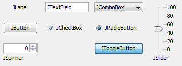

# EMU guide

#### Table of content

1. [Why use EMU?](#why)
2. [EMU: a user perspective](#user)
   1. [Configuration](#user-conf)
   2. [Plugin](#user-plug)
3. [Implementing your UI with EMU](#impl)
   1. [EMU principle](#emuprinc)
   2. [JComponents](#jcompo)
   3. [ConfigurablePanel](#confpane)
      1. [UIProperty](#uiprop)
      2. [SwingUIListeners methods](#swing)
      3. [UIParameter](#uiparam)
      4. [InternalProperty](#intprop)
      5. [Implementing a ConfigurablePanel](#implconf)
      6. [Methods calling order](#orderpane)
      7. [Useful methods](#useflpane)
   4. [ConfigurableMainFrame](#confframe)
      1. [Plugin Settings](#plugsettgs)
      2. [Instantiating the ConfigurablePanels](#instframe)
      3. [Methods calling order](#orderframe)
      4. [Useful methods](#useflframe)
   5. [UIPlugin](#uiplug)
   6. [Drag and drop softwares](#dragndrop)
4. [Resources](#res)
   1. [Tutorial](#tuto)
   2. [Examples](#ex)
   3. [htSMLM](#htsmlm)


## Why use EMU?  <a name="why"></a>  

Micro-Manager controls the devices on your microscope using device properties (e.g. laser on/off). All device properties can be access through the device property browser. However, controlling the microscope through a long list of properties is cumbersome and rather aimed at the microscope engineer than at the user. While interaction with device properties can be facilitated by using configuration preset groups or the quick access plugin, these cannot replace a user interface tailored to the microscope. 

Tailored interfaces have the advantage of rendering the control of the microscope intuitive. However, tailoring the UI often means hard-coded references to the specific device properties and a need to recompile every time something changes on the microscope.

Easier Micro-manager User interface (EMU) offers means to make your Micro-Manager interface reconfigurable:

- Compatible with **drag and drop softwares**: rapid design of your UI.
- No need to hard code device property names.
- Easy and intuitive configuration of the UI through EMU's interface.
- Switch between multiple configurations in a single click.
- No compiling necessary when you exchange devices.
- One UI to rule them all: easy transfer between your microscopes.


important points:

-> rapid design of a UI and operation (better word?)

-> no hard-coding: emu provides intuitive and easy configuration without further implementation

## EMU: a user perspective  <a name="user"></a>  

UI are emu plugins

In EMU, UIs consist of a single frame (ConfigurableMainFrame) composed of multiple panels (ConfigurablePanels). The frame offers some settings, while each panel declares a number of properties and parameters:

- Settings allow to define options, such as titles or showing/hiding a panel.
- Properties are mapped through EMU's interface to Micro-Manager device properties.
- Parameters are used to customize the panels (e.g. titles, colors, enable/disable button)


### Configuration  <a name="user-conf"></a>  

#### Configuration wizard

Once EMU is loaded in Micro-manager, the user can configure the UI graphically by using the configuration wizard accessible through "**Configuration -> modify configuration**" (it is automatically started if no configuration is found):


The configuration wizard has four tabs:

- Properties
- Parameters
- Plugin Settings
- Global Settings


##### Mapping the properties

choose device in the drop down list. note that the preset groups also appear and can also be mapped.

some properties have a finite number of state, these will appear as either on/off states or states #. Using the device property browser, enter a value for each state.

##### Setting the parameters

##### Plugin settings

##### Global settings

##### Configuration name

changing the configuration name will create a new configuration, configurations can only be deleted by the configuration manager.

##### Help window

Selecting the help button will prompt the help window. select a row in the in the table your are looking at to access a description of the property, parameter or setting.

##### Saving the configuration


#### Configuration manager

delete configurations


#### Switch plugin

load another plugin instead of the current one


#### Switch configuration

switch to another configuration

### Plugin  <a name="user-plug"></a>  

#### Refresh

synchronizes the states of the UI components to the current value of the device properties.

#### Description

all panel descriptions


## Implementing your UI with EMU  <a name="impl"></a>  


### EMU principle  <a name="emuprinc"></a>  

ConfigurablePanels are the building blocks of the UI, they declare UIProperties (e.g. laser power percentage) and UIParameters (e.g. title color).

ConfigurablePanels are assembled in a single ConfigurableMainFrame. The latter also defines plugin Settings, allowing for instance having optional panels or defining how many panels of a certain type are there (how many lasers?).


### JComponents  <a name="jcompo"></a>  



### ConfigurablePanel  <a name="confpane"></a>  

#### UIProperty  <a name="uiprop"></a>  


| UIProperty type       | Note                                                         | Example use                                        |
| --------------------- | ------------------------------------------------------------ | -------------------------------------------------- |
| UIProperty            | general property                                             | JTextFields<br />JSpinners<br />JSliders           |
| SingleStateUIProperty | accepts a single state only                                  | JButtons                                           |
| TwoStateUIProperty    | accepts a On and Off states                                  | JToggleButtons<br />JCheckBoxes<br />JRadioButtons |
| MultiStateUIProperty  | accepts a finite number of states                            | ButtonGroups<br />JComboBoxes                      |
| RescaledUIProperty    | rescales a property, UIParameters<br />can be used to let the user decide the <br />rescaling in the configuration | JTextFields<br />JSpinners<br />JSliders           |


##### flags


#### SwingUIListeners methods  <a name="swing"></a>  

#### UIParameter  <a name="uiparam"></a>  

UIParameters are parameters that are communicated to a ConfgiurablePanel at the start of EMU or after saving a configuration. They are of different types:


| UIParameter types     | Type                            | Example use                                                  |
| --------------------- | ------------------------------- | ------------------------------------------------------------ |
| BoolUIParameter       | Boolean value                   | enable/disable a button<br />hide/show a JPanel<br />default value for a JComponent |
| ColorUIParameter      | Color object                    | title color<br />button color                                |
| ComboUIParameter      | String value from a known array | default value of a JComboBox<br />choice between several options |
| DoubleUIParameter     | Double value                    | set an attribute value                                       |
| IntegerUIParameter    | Integer value                   | set an attribute value                                       |
| StringUIParameter     | String value                    | title or text<br />comma separated values                    |
| UIPropertyUIParameter | String label of a UIProperty    | to be able to query another UIProperty                       |


```java
// parameter
public final static String PARAM_LABEL = "Name of the parameter"; 

@Override
protected void initializeParameters() {
	
    String description = "Description of the parameter";
    boolean default_val = true;
    this.addUIParameter(new BoolUIParameter(this, PARAM_LABEL, 
                                            description, default_val));
}

@Override
protected void parameterhasChanged(String parameterName) {
	if(PARAM_LABEL.equals(parameterName)) { 
		try {
			boolean b  = getBoolUIParameterValue(PARAM_LABEL);
            // do something with b
		} catch (IncorrectUIParameterTypeException | UnknownUIParameterException e) { 
			e.printStackTrace();
		}
	}
}
```


#### InternalProperty  <a name="intprop"></a>  

InternalProperties are intended to share values between two ConfigurablePanels. They are declared by using the following method in initializeInternalProperties():

```java
addInternalProperty(...);
```

If two InternalProperties bear the same label (in their instantiation) and are of the same type, then those two InternalProperties will be fused and the two ConfigurablePanels will share the same one.

InternalProperties are of the following type:

- **BoolInternalProperty**

- **DoubleInternalProperty**

- **IntegerInternalProperty**

  

###### usage example:

In two ConfigurablePanels:

```java
public final static String INTERNAL_VALUE = "Shared value";

@Override
protected void initializeInternalProperties() {		
	int value = 0;
    addInternalProperty(new IntegerInternalProperty(this, INTERNAL_VALUE, value));
}

@Override
public void internalpropertyhasChanged(String label) {
	if(INTERNAL_MAXPULSE.equals(label)){
		try {
			int value = getIntegerInternalPropertyValue(INTERNAL_MAXPULSE);
            // do something
		} catch (IncorrectInternalPropertyTypeException |
                  UnknownInternalPropertyException e) {
			e.printStackTrace();
		}
	}
}
```

Then, when the InternalProperty is modified in ConfigurablePanel #1:

```java
try {
	setInternalPropertyValue(INTERNAL_VALUE,val);
} catch (IncorrectInternalPropertyTypeException | UnknownInternalPropertyException e) {
	e.printStackTrace();
}
```

Then internalpropertyhasChanged(INTERNAL_VALUE) is called in the second ConfigurablePanel #2.


#### Implementing a ConfigurablePanel  <a name="implconf"></a>  

#### Methods calling order  <a name="orderpane"></a>  

All components should be declared and added in the constructor.

1. super-constructor()
2. initializeProperties() 
3. initializeParameters()
4. initializeInternalProperties()
5. rest of the constructor() (instantiation of the JComponents)

Then call from ConfigurableMainFrame causes:

1. propertyhasChanged() on all UIProperties
2. parameterhasChanged() on all UIParameters
3. addComponentListeners() (parameters apply and the first update of the UIProperties does not trigger a changeUIProperty)

Other methods:

#### Useful methods  <a name="useflpane"></a>  

### ConfigurableMainFrame  <a name="confframe"></a>  

#### Plugin Settings  <a name="plugsettgs"></a>  


```java
private final static String SETTING_USE_PANEL = "Use panel";
private final static String SETTING_NB_BUTTONS = "Number of buttons";
private final static String SETTING_TITLE_PANE = "Panel title";

@Override
public HashMap<String, Setting> getDefaultPluginSettings() {
	HashMap<String, Setting> defaultSettings = new HashMap<String, Setting>();

    String desc_use_panel = "Check to use the JPanel.";
    BoolSetting use_panel = new BoolSetting(SETTING_USE_TRIGGER, desc_use_panel, true);
    defaultSettings.put(SETTING_USE_PANEL, use_panel);

    String desc_nb_buttons = "Number of Buttons.";
    IntSetting number_buttons = new IntSetting(SETTING_NB_BUTTONS,desc_nb_buttons,4);
    defaultSettings.put(SETTING_NB_BUTTONS, number_buttons);

    String desc_title_pane = "Title of Panel.";
    StringSetting title_pane = new StringSetting(SETTING_TITLE_PANE,desc_title_pane
                                                 ,"Title");
    defaultSettings.put(SETTING_TITLE_PANE, title_pane);
    
	return defaultSettings;
}
```


```java
boolean b = ((BoolSetting) settings.get(SETTING_USE_PANEL)).getValue();
int b = ((IntSetting) settings.get(SETTING_NB_BUTTONS)).getValue();
String b = ((StringSetting) settings.get(SETTING_TITLE_PANE)).getValue();
```


#### Instantiating the ConfigurablePanels  <a name="instframe"></a>  

#### Methods calling order  <a name="orderframe"></a>  

1. super-constructor(), this includes setting the Settings
2. register the settings (plugin settings from the configuration)
3. initComponents() (where all ConfigurablePanels are instanciated)
4. link all InternalProperties
   1. if two InternalProperties have the same label and type, then they become shared between the two ConfigurablePanels.
   2. if they have the same label but different types, then the second discovered InternalProperty is ignored
5. retrieves UIProperties and UIParameters
   1. if two properties have the same label, only the last one is kept (unknown order)
   2. if two parameters have the same label and type they become shared between the two ConfigurablePanels. If not, the second discovered one is ignored.

Upon saving a new configuration or loading one:

1. All of the above in order.
2. update all ConfigurablePanels (propertyHasChanged(), then parameterHasChanged())
3. addComponentListeners() on all ConfigurablePanels 


#### Useful methods  <a name="useflframe"></a>  

### UIPlugin  <a name="uiplug"></a>  

### Drag and drop softwares  <a name="dragndrop"></a>  

## Resources  <a name="res"></a>  

### Tutorial  <a name="tuto"></a>  

### Examples  <a name="ex"></a>  

### htSMLM  <a name="htsmlm"></a>  


