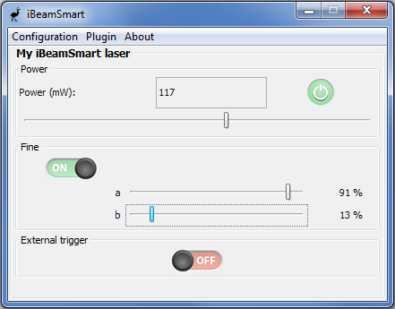
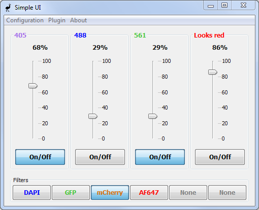

# EMU examples

[Easier Micro-manager User interface (EMU)]( https://github.com/jdeschamps/EMU ) is a [Micro-Manager](https://micro-manager.org/wiki/Micro-Manager) plugin that loads easily reconfigurable user interfaces to control your microscope. 

This repository contains examples of EMU plugins:

- [Base plugin]( https://github.com/jdeschamps/EMU-guide/tree/master/examples/ baseplugin): An empty plugin with comments within each method, explaining what needs to be implemented. Can be used as basis for a [new project](#newproject).

- [iBeamSmart]( https://github.com/jdeschamps/EMU-guide/tree/master/examples/ ibeamsmart): A simple UI controlling a single iBeamSmart laser (Toptica), including on/off, power percentage, fine percentages and external trigger.

  


- [Simple UI]( https://github.com/jdeschamps/EMU-guide/tree/master/examples/ simpleui): A UI similar to the example developed in the [EMU tutorial]( https://github.com/jdeschamps/EMU-guide/tutorial ), albeit with optional scaling of laser power (mW) to laser percentage (%).

  
  
  

# Installation

1. Follow the installation steps for [EMU](https://github.com/jdeschamps/EMU)

2. Using the console, go to the folder you wish to install **EMU-examples** in and type (omitting the $):

   ```bash
   $ git clone https://github.com/jdeschamps/EMU-examples.git
   ```

3. Finally, compile all the examples using Maven

   ```bash
   $ cd emu-examples
   $ mvn clean install
   ```

4. Then for each example, copy the .jar file generated in the **example-name/target/** folder to **/Micro-Manager/EMU/**. e.g.: "emu-examples/ibeamsmart/target/ibeamsmart-1.0.jar".

5. Start Micro-Manager and select **Plugins->Interface->EMU**.


# Base plugin as a starting project <a name="newproject"></a>

1. Copy the "baseplugin/src" folder in your own project folder.
2. In Eclipse, create a new Java project and uncheck "use default location". Choose your project folder. Make sure Java 1.8 or 8 is selected. Click next.
3. Verify that the source folder is "src/main/java". In the Libraries tab, add an external JAR and navigate to the emu jar present in your Micro-Manager folder ("Micro-Manager/mmplugins/" if EMU was correctly installed). Then, click on finish.
4. You can then rename the package to match your institution, name and project name, as well as renaming the different classes.

> Note: When you change the name of the packages and of BasePlugin.java, you will need to change the path in the "src/main/resources/META-INF/services/de.embl.rieslab.emu.plugin.UIPlugin" file accordingly (the file name itself should NOT change).

