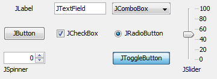

# JComponents 

JComponents are the Swing elements the user interacts with and are central to building a ConfigurablePanel. Here are examples of useful components:




The following section is composed of snippets of codes covering often used cases in Swing. In particular, these snippets are useful when implementing the ConfigurablePanel methods propertyhasChanged() and  parameterhasChanged() in which JComponents should be modified. 

Note that the action listeners are already implemented as static methods in SwingUIListeners and should be called in the ConfigurablePanel method addComponentListeners(). 

The list is not exhaustive.

## Table of contents

1. [JTextField](#jtextfield)
2. [JToggleButton/JCheckBox](#jtogglebutton)
3. [JButton](#jbutton)
4. [JComboBox](#jcombobox)
5. [Jslider](#jslider)
6. [JSpinner](#jspinner)
7. [ButtonGroup](#buttongroup)
8. [JLabel](#jlabel)
9. [Titledborder](#titledborder)

[Back to the programming guide](programmingguide.md)

[Back to the main menu](index.md)


### JTextField<a name="jtextfield"></a> 

#### Set font

```java
JTextField txtf = new JTextField();
txtf.setFont(new Font("Tahoma", Font.BOLD, 12));
```

#### Set text color

```java
JTextField txtf = new JTextField();
txtf.setForeground(Color.red);
```

#### Action listeners

To have a trigger when the "Enter" key is pressed:

```java
JTextField txtf = new JTextField();
txtf.addActionListener(new ActionListener(){
	public void actionPerformed(ActionEvent e){
        String text = txtf.getText();
		
        // Do something
        doSomething(text);
	}
});
```

Or trigger when the focus is lost:

```java
JTextField txtf = new JTextField();
txtf.addFocusListener(new FocusListener() {
	@Override
	public void focusGained(FocusEvent ex) {}

	@Override
	public void focusLost(FocusEvent ex) {
		String s = txtf.getText();
		
        // Do something
        doSomething(text);
	}
});
```

Note that those actions listeners are not incompatible. 

#### Modifying a JTextField

```java
JTextField txtf = new JTextField("0");
String s = "1";
txtf.setText(s);
```


### JToggleButton/JCheckBox<a name="jtogglebutton"></a>  

#### Set font

```java
JToggleButton tglb = new JToggleButton("On/Off");
tglb.setFont(new Font("Tahoma", Font.BOLD, 12));
```

#### Set margin

```java
JToggleButton tglb = new JToggleButton("On/Off");
tglb.setMargin(new Insets(2, 2, 2, 2));
```

#### Set text color

```java
JToggleButton tglb = new JToggleButton("On/Off");
tglb.setForeground(Color.red);
```

#### Action listener

```java
JToggleButton tglb = new JToggleButton("On/Off");
tglb.addActionListener(new ActionListener() {
	public void actionPerformed(ActionEvent actionEvent) {
		AbstractButton abstractButton = (AbstractButton) actionEvent.getSource();
		boolean selected = abstractButton.getModel().isSelected();

		// Do something
		doSomething(selected);
	}
});
```

#### Modifying a JToggleButton

```java
JToggleButton tglb = new JToggleButton("On/off");
boolean b = false;
tglb.setSelected(b);
```

#### Enable/disable

```java
JToggleButton tglb = new JToggleButton("On/off");
boolean b = false;
tglb.setEnable(b);
```


### JButton<a name="jbutton"></a>  

#### Action listener

```java
JButton btn = new JButton("Click me");
btn.addActionListener(new ActionListener() {
	public void actionPerformed(ActionEvent e) {
		doSomething();
	}
});
```

#### Enable/disable

```java
JButton tglb = new JButton("Click me");
boolean b = false;
tglb.setEnable(b);
```


### JComboBox <a name="jcombobox"></a>  

#### Action listener

```java
String[] strarr = {"Value1","Value2","Value3"};
JComboBox<String> cbx = new JComboBox();
cbx.addActionListener(new ActionListener(){
    public void actionPerformed(ActionEvent e){
		String val = String.valueOf(cbx.getSelectedItem());
        int index = cbx.getSelectedIndex();
        
        // Do something
        doSomething(val);
	}
});
```

#### Modifying a JComboBox

```java
String[] strarr = {"Value1","Value2","Value3"};
JComboBox<String> cbx = new JComboBox();
cbx.setSelectedIndex(1);
cbx.setSelectedItem(strarr[2]);
```

Note that this will trigger the action listener of the previous section.


### JSlider<a name="jslider"></a>  

#### Action listener

```java
JSlider sld = new JSlider();
sld.addMouseListener(new MouseAdapter() {
	public void mouseReleased(MouseEvent e) {
		int val = sld.getValue();

        // Do something
		doSomething();
	}
});
```

#### Modifying a JSlider

```java
JSlider sld = new JSlider();
sld.setValue(10);
```


### JSpinner<a name="jspinner"></a>  

#### Action listener

```java
// integer step size
SpinnerNumberModel model = new SpinnerNumberModel(0,-5,5,1);
JSpinner spnr = new JSpinner(model);
spnr.addChangeListener(new ChangeListener() {
	@Override
	public void stateChanged(ChangeEvent e) {
		int val = (int) spnr.getValue();
				
		// Do something
		doSomething();
	}
});
```

### 

#### Modifying a JSpinner

```java
SpinnerNumberModel model = new SpinnerNumberModel(0,-5,5,1);
JSpinner spnr = new JSpinner(model);
spnr.setValue(2);
```


### ButtonGroup<a name="buttongroup"></a>   

#### Action listener

```java
ButtonGroup bg = new ButtonGroup();
		
// Instantiates the buttons and adds them to the button group
int N = 5;
for(int i=0;i<N;i++){
    JToggleButton btn = new JToggleButton("Button"+i);
    bg.add(btn);		    
}

// Adds the action listeners
Enumeration<AbstractButton> enm = bg.getElements();
int counter = 0;
while(enm.hasMoreElements()) {
	final int pos = counter;
	AbstractButton btn = enm.nextElement();		
	btn.addActionListener(new ActionListener(){
	   	public void actionPerformed(ActionEvent e){
			// Do something
            doSomething(pos);
		}
	});	
	counter++;
}
```

### 

### JLabel<a name="jlabel"></a>  

#### Modifying a JLabel

```java
JLabel lbl = new JLabel("Label");
lbl.setText("New text");
```

#### Set font and font size

```java
JLabel lbl = new JLabel("Label");
lbl.setFont(new Font("Tahoma", Font.BOLD, 12));
```


### TitledBorder <a name="titledborder"></a> 

#### Modifying a TitledBorder title and color

```java
// Instiates the JPanel and its titledborder
JPanel pane = new JPanel();
Font f = new Font("Tahoma", Font.BOLD, 12);
Color c = Color.blue;
pane.setBorder(new TitledBorder(null, "Title", TitledBorder.LEFT, TitledBorder.TOP, f, c));

// Modifying title
TitledBorder border = (TitledBorder) pane.getBorder();
String title = "New title";
border.setTitle(title);
		
// Modifying color
Color c2 = Color.red;
border.setTitleColor(c2);
		
pane.repaint();
```


[Back to the programming guide](programmingguide.md)

[Back to the main menu](index.md)