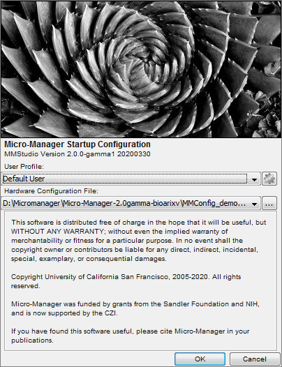
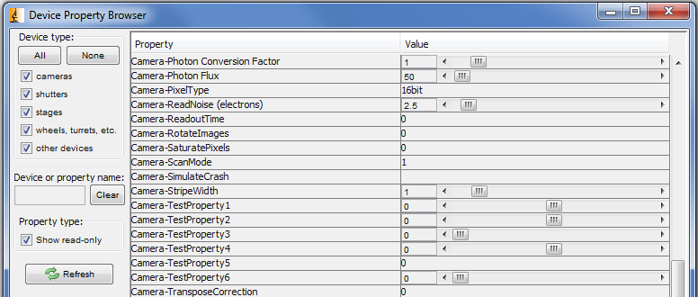
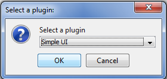
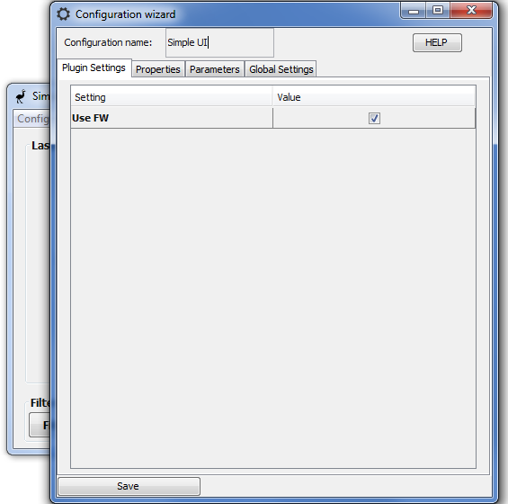
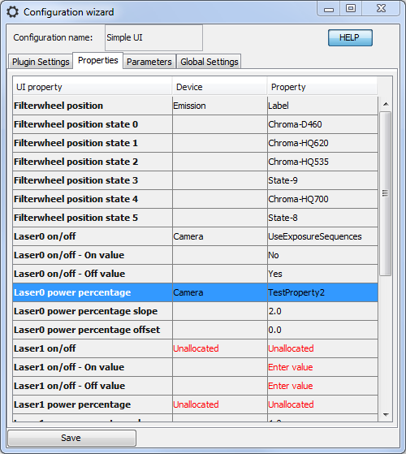
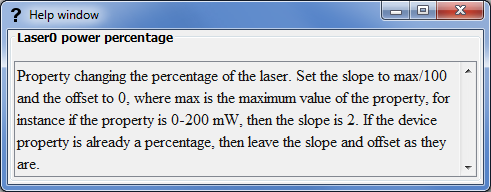
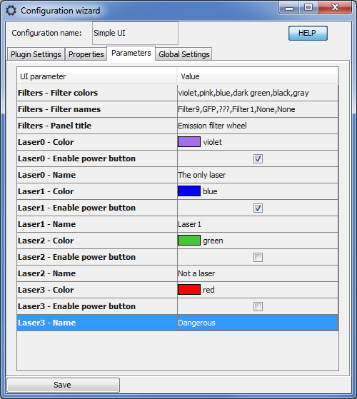
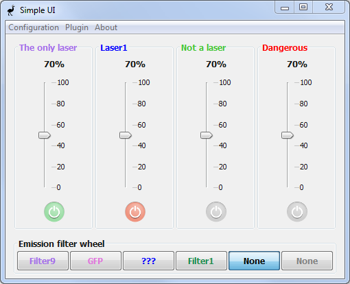

## Quick introduction

In this section, we demonstrate how to quickly test EMU with one of its default plugin. The purpose is simply to illustrate the interaction between EMU plugins and the devices loaded in Micro-Manager using the demo configuration. You can follow the introduction using your own Micro-Manager configuration. For more details, please refer to the [user guide](userguide.md).

1. Upon the first start of Micro-Manager, a device configuration named "**MMConfig_demo.cfg**" should be available. If not, locate it in your installation folder during Micro-Manager boot up and select it. 

   

   
   

2. By clicking on "Devices/Device Property Browser" in the Micro-Manager menu, you have access to all device properties that can be used to control the hardware (here only simulated). In particular, you can check which values are accepted by the device properties. Later on, we will use this to input values in the EMU configuration.

   

   
   

3. In Micro-Manager, start EMU under "Plugins/User Interface/EMU" and select SimpleUI. SimpleUI and the other default interface are EMU plugins.

   

   
   

4. Several windows open, including the plugin itself and the EMU configuration menu (configuration wizard):

   

   
   

   The **plugin settings** tab in this case has a single entry: hiding or showing the filters. The purpose of the other tabs are as following: the **properties** should be paired with Micro-Manager devices, the **parameters** can be configured to make the UI more intuitive and the **global settings** are EMU options.

5. In the **Properties** tab, pair UI properties with Micro-Manager devices and select a device property. Then, input allowed values in the state values.

   

   
   

   For instance here, for the **filter wheel position** UI property, we selected the **Emission** device and its **Label** device property. Then, looking at the **Device Property Browser** (see point 2), we identified allowed values and input them in the state rows. Alternatively, we could have used the **State** device property.
   We also filled in **Laser0 on/off** and **Laser0 power percentage** UI properties, according to values observed in the **Device Property Browser**.
   Note that we intentionally set the labels in a different order than their state in the Device Property Browser, or the laser power on/off to No=On and Yes=Off.

6. By clicking on the Help button and selecting a row, you have access to a description of the property or parameter. Here for the **Laser0 power percentage** UI property:

   

   
   

7. Then, we move on to the **Parameters** tab. Here you can choose the name and colors that will appear in the interface. You can also disable the on/off buttons of the lasers.

   

   
   

   The help window on the first parameter tells us which color we can use in the coma-separated entry. We also entered few filter names (ideally they should correspond, and be in the same order, than in the property tab). Finally, we named the lasers, gave them a color and disabled some on/off buttons. 

8. Save the configuration. Ignore the message indicating that some UI properties have not be set. It can be disabled in the **Global settings** tab of the configuration. The UI looks as follows:

   

   
   

   As we can see, colors and names corresponds the properties entry.

9. Now, by clicking on the UI buttons (specifically the filter wheel and the first lasers) and refreshing the Device Property Browser, you can verify that the device properties that we mapped to the UI properties are changed by interacting with the UI. For instance, the first laser percentage brings the TestProperty2 from Camera from 0 to 200 (because the slope was set to 2), and the filter wheel labels are consistent with the order in which we set them.
   Since we did not map the UI properties of the three other lasers, the other buttons have no effect.

We have now successfully used the EMU configuration wizard to set-up an EMU plugin and used it to change Micro-Manager device properties. In the real world, changing the device properties will change the state of your hardware! Thanks to the configuration menu, a single UI is transferable to instruments with different devices and can be set-up in a matter of a few minutes.

What else can we do in the interface?

- Create multiple configurations by changing the configuration name in the configuration wizard.
- Switch between configurations.
- Switch between plugins.
- Delete configuration from the configuration manager.

All plugin settings, properties and parameters come from the EMU plugin itself and will vary from plugin to plugin. EMU provides a framework to configure the interfaces and take care of the interaction with the devices, the decision of which aspects of the interface are configurable lies with the plugin developers.

Refer to the [user guide](userguide.md) for more details on how to use EMU plugins and to the [programming guide](programmingguide.md) in order to implement your own interface plugin. A [tutorial](tutorial) demonstrating how to build a user interface for EMU using graphical tools is also available.

[Back to the main menu](index.md)

